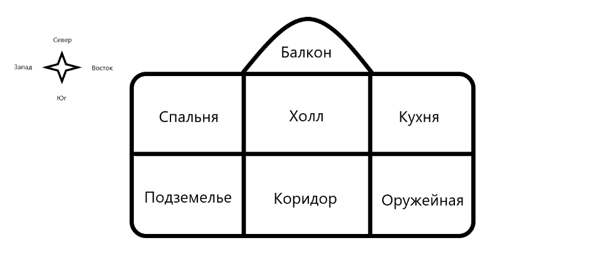
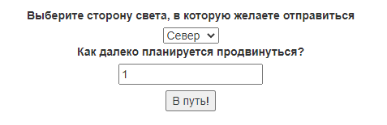

# QuestGame
Данный репозиторий хранит учебный проект для stepik.org, разработанный на микрофреймворке "Flask".
Проект полностью закончен и представляет из себя веб-сайт с небольшой игрой в жанре "квест".
Сайт состоит из 3-х страниц:
- Стартовая страница
- Страница регистрации игрока (там нужно просто ввести имя)
- Страница с игрой

Смысл игры заключается в перемещении игрока по игровой карте с целью попасть в 
локацию "Балкон". Стартовая локация игрока выбирается рандомно (сразу оказаться
на балконе невозможно).

Выбор направления движения и кол-во шагов определяется игроком посредством заполнения
и отправки на сервер формы. 

Так же в проекте реализована привязка веб-сайта к SQL-серверу (MySQL). 
В соответствующую таблицу базы данных записываются следующие данные игрока:
- Имя игрока
- Номер игровой сессии (генерируется при заполнении формы регистрации)
- Кол-во шагов затраченных на путь до балкона (заполняется при завершении игры)

## Проект состоит из 7 .py файлов и папки "templates".

### main
Содержит backend-логику сайта (экземпляр **Flask** и 3 функции представления).

### forms
Содержит классы форм **QuestForm** и **RegistrationForm**, используемые на страницах сайта.

### game_logic
Содержит класс **Game** реализующий логику игры и предоставляющий методы работы с ней. 

### database_connect
Содержит функции для взаимодействия с SQL-сервером.

### config
Содержит секретный ключ, а так же переменные для подключения к SQL-серверу 
(пароль лежит в "password.py")

### generate_number
Содержит функцию для создания номера игровой сессии.

### password
Содержит пароль от SQL-сервера(на githab данный файл, по понятным причинам, не выкладываю).
Проект будет работать и без него. 

### папка "templates"
Содержит .html файлы. Для визуального оформления веб-сайта используется
**bootstrap**.
